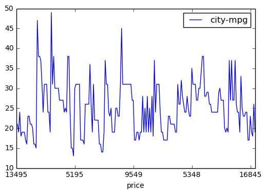
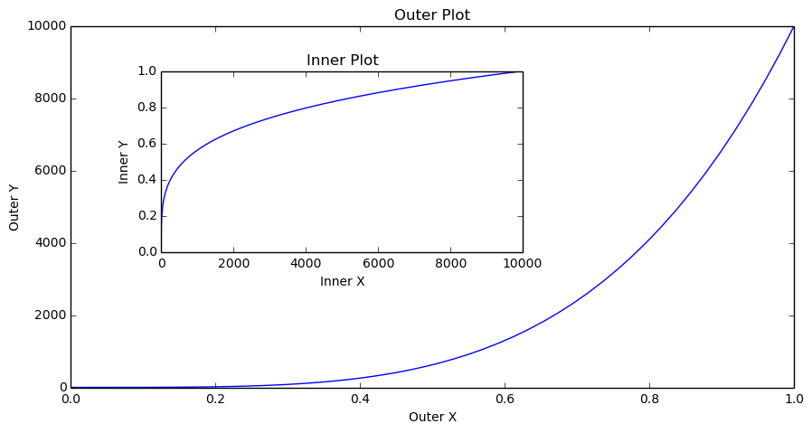
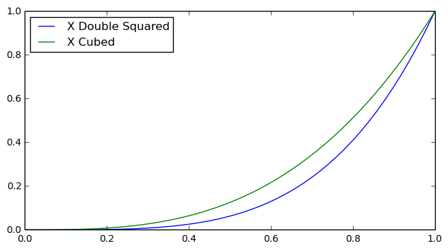
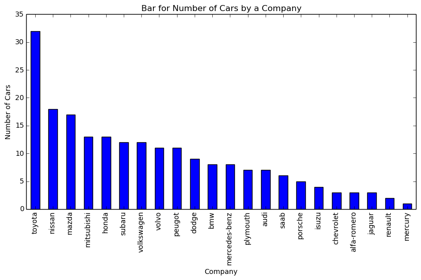
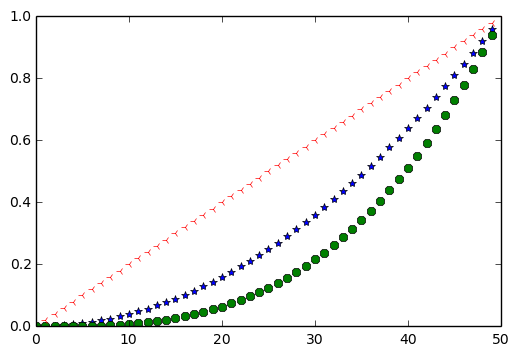
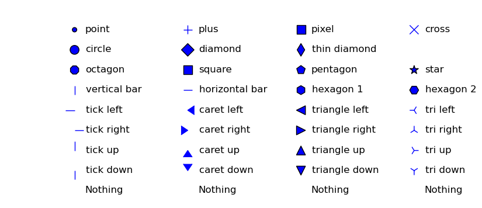
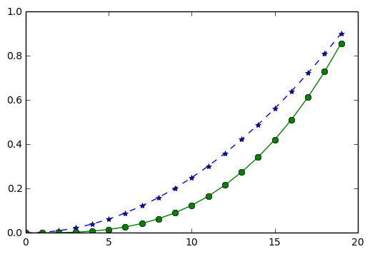
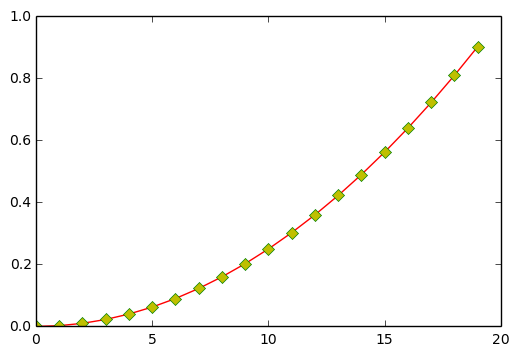
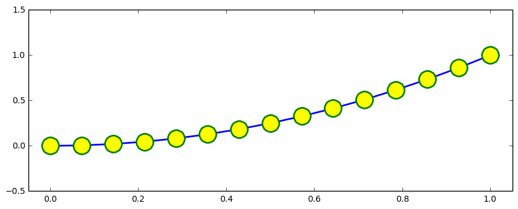
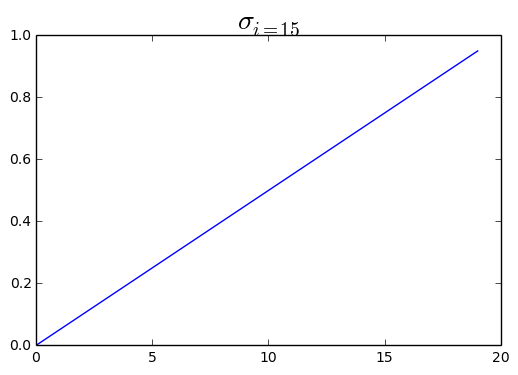

```python
import pandas as pd
import numpy as np
import matplotlib.pyplot as plt
```

##### You can import matplotlib.pyplot the way you like but this the most used convention you'll see anywhere

 #####  


```python
%matplotlib inline
```

 #### This is a magic function to enable inline plots

 ####  


```python
df = pd.read_csv('auto_mobile_price_data.csv')
df.head(2)
```


<div>
<table border="1" class="dataframe">
  <thead>
    <tr style="text-align: right;">
      <th></th>
      <th>symboling</th>
      <th>normalized-losses</th>
      <th>make</th>
      <th>fuel-type</th>
      <th>aspiration</th>
      <th>num-of-doors</th>
      <th>body-style</th>
      <th>drive-wheels</th>
      <th>engine-location</th>
      <th>wheel-base</th>
      <th>...</th>
      <th>engine-size</th>
      <th>fuel-system</th>
      <th>bore</th>
      <th>stroke</th>
      <th>compression-ratio</th>
      <th>horsepower</th>
      <th>peak-rpm</th>
      <th>city-mpg</th>
      <th>highway-mpg</th>
      <th>price</th>
    </tr>
  </thead>
  <tbody>
    <tr>
      <th>0</th>
      <td>3</td>
      <td>?</td>
      <td>alfa-romero</td>
      <td>gas</td>
      <td>std</td>
      <td>two</td>
      <td>convertible</td>
      <td>rwd</td>
      <td>front</td>
      <td>88.6</td>
      <td>...</td>
      <td>130</td>
      <td>mpfi</td>
      <td>3.47</td>
      <td>2.68</td>
      <td>9.0</td>
      <td>111</td>
      <td>5000</td>
      <td>21</td>
      <td>27</td>
      <td>13495</td>
    </tr>
    <tr>
      <th>1</th>
      <td>3</td>
      <td>?</td>
      <td>alfa-romero</td>
      <td>gas</td>
      <td>std</td>
      <td>two</td>
      <td>convertible</td>
      <td>rwd</td>
      <td>front</td>
      <td>88.6</td>
      <td>...</td>
      <td>130</td>
      <td>mpfi</td>
      <td>3.47</td>
      <td>2.68</td>
      <td>9.0</td>
      <td>111</td>
      <td>5000</td>
      <td>21</td>
      <td>27</td>
      <td>16500</td>
    </tr>
  </tbody>
</table>
<p>2 rows × 26 columns</p>
</div>


 ####  

### Draw a line plot for Price against City MPG


```python
#df.plot(x='price', y='city-mpg')

# OR
# df.plot.line(x='price', y='city-mpg')

# OR
df.plot(kind='line', x='price', y='city-mpg')
plt.show()
```





#### Default plot type is line plot. other kinds can be scatter, bar, histo etc

#### If you want to have multiple plots within same figure, you need to create a figure with custom size first,
#### define axes
#### define title, x label, y label for each axes
#### A figure can have many axes (plots)
####    An axes have x axis and y axis
    

 ####  


```python
fig = plt.figure(figsize=(10, 5))

# A figure with 10 inches of width and 5 inches of height

axes1 = fig.add_axes([0.1, 0.1, 0.8, 0.8])
axes2 = fig.add_axes([0.2, 0.4, 0.4, 0.4])

# [0.1, 0.1, 0.8, 0.8]
# 0.1 Distance from Left
# 0.1 Distance from Bottom
# 0.8 Width of the axes or width of the current plot
# 0.8 Height of the axes or height of the current plot

axes1.set_title('Outer Plot')
axes2.set_title('Inner Plot')

axes1.set_xlabel('Outer X')
axes1.set_ylabel('Outer Y')

axes2.set_xlabel('Inner X')
axes2.set_ylabel('Inner Y')

x = np.linspace(0, 1, 50)
y = np.linspace(0, 10, 50)**4

axes1.plot(x, y)
axes2.plot(y, x)
plt.show()
```





```python

```

### Add Legend to Plot


```python
fig = plt.figure()
ax = fig.add_axes([0, 0, 1, 0.8])
ax.plot(x, x**4, label='X Double Squared')
ax.plot(x, x**3, label='X Cubed')

ax.legend(loc=0)

# loc=0 : best fit
# these digits range from 0 to 10 for left, top left, bottom, center etc.
# (0.1, 0.5) = disance from X-axis and distance from Y-axis.

plt.show()
```





#### If you want to show counts of categorical values like number of mobiles released by each company, earthquake hits per ear then you should consider Bar plot which shows counts against a category

##### get number of cars (counts) for each make (company) (category)


```python
company_counts = df['make'].value_counts()
```


```python
fig = plt.figure(figsize=(10,5))
axes = fig.gca()
# get current axes

axes.set_title("Bar for Number of Cars by a Company")
axes.set_xlabel('Company')
axes.set_ylabel('Number of Cars')
company_counts.plot(kind='bar', ax=axes)
plt.show()
```





 ####  

### You can show markers on plot instead of Lines or Bars.


```python
x = np.arange(0, 50)
y = np.arange(0, 1, 0.02)
plt.plot(x, y**2, '*', x, y**3, '8',  np.arange(50, 0, -1), np.arange(1, 0, -0.02), '3')
plt.show()
# 3rd argument will considered as marker. Marker value either be a string or numerical, depending on marker type
```





### This is the List of available markers. Details can be found [here](https://matplotlib.org/api/markers_api.html)

 ####  


```python
xs, ys = np.mgrid[:4, 9:0:-1]

markers = [".", "+", ",", "x", "o", "D", "d", "", "8", "s", "p", "*", "|", "_", "h", "H", 0, 4, "<", "3",
           1, 5, ">", "4", 2, 6, "^", "2", 3, 7, "v", "1", "None", None, " ", ""]

descripts = ["point", "plus", "pixel", "cross", "circle", "diamond", "thin diamond", "",
             "octagon", "square", "pentagon", "star", "vertical bar", "horizontal bar", "hexagon 1", "hexagon 2",
             "tick left", "caret left", "triangle left", "tri left", "tick right", "caret right", "triangle right", "tri right",
             "tick up", "caret up", "triangle up", "tri up", "tick down", "caret down", "triangle down", "tri down",
             "Nothing", "Nothing", "Nothing", "Nothing"]

fig, ax = plt.subplots(1, 1, figsize=(10, 4))

for x, y, m, d in zip(xs.T.flat, ys.T.flat, markers, descripts):
    ax.scatter(x, y, marker=m, s=120)
    ax.text(x + 0.1, y - 0.1, d, size=12)
    ax.set_axis_off()
    
plt.show()
```

    /usr/lib/pymodules/python2.7/matplotlib/collections.py:548: FutureWarning: elementwise comparison failed; returning scalar instead, but in the future will perform elementwise comparison
      if self._edgecolors == 'face':





### Show markers over the line instead of just markers


```python
x = np.arange(0, 20)
y = np.arange(0, 1, 0.05)
plt.plot(x, y**2, '*--', x, y**3, '8-')
plt.show()

# First letter in 3rd/6th argument denotes marker type and seconds denotes line type i.e dotted, dashed, 
# dashed dotted
```





 ###  

### Make a Plot that has dotted red line, Large yellow diamond markers having green edge


```python
x = np.arange(0, 20)
y = np.arange(0, 1, 0.05)
plt.plot(x, y**2, 'r-', marker='D', markerfacecolor='y', markeredgecolor='g')

# OR

# plt.plot(x, y**2, 'r-', marker='D', mfc='y', mec='g')

# OR

# plt.plot(x, y**2, 'r-D', mfc='y', mec='g')

# mec = markeredgecolor
# mfc = markerfacecolor
# r-D = red, line with -, Diamond marker

plt.show()
```





 ###  

### Line and Marker with different available options


```python
fig = plt.figure(figsize=(8, 3))
axes = fig.add_axes([0, 0, 1, 1])

x = np.linspace(0, 1, 15)

axes.plot(x, x**2, color='blue', linewidth=2, linestyle='-', marker='o', markerfacecolor='yellow', markersize=20,
         markeredgewidth=2, markeredgecolor='green')

axes.set_xlim(-0.05, 1.05)
axes.set_ylim(-0.5, 1.5)

plt.show()
```





## MathText

#### You can show Math symbols inside plot like sigma or pie or any other symbol


```python
plt.plot(np.arange(0, 20), np.arange(0, 1, 0.05))
plt.title(r'$\sigma_{i=15}$', fontsize=20)
plt.show()

# To make subscripts and superscripts, use the '_' and '^' symbols
```




